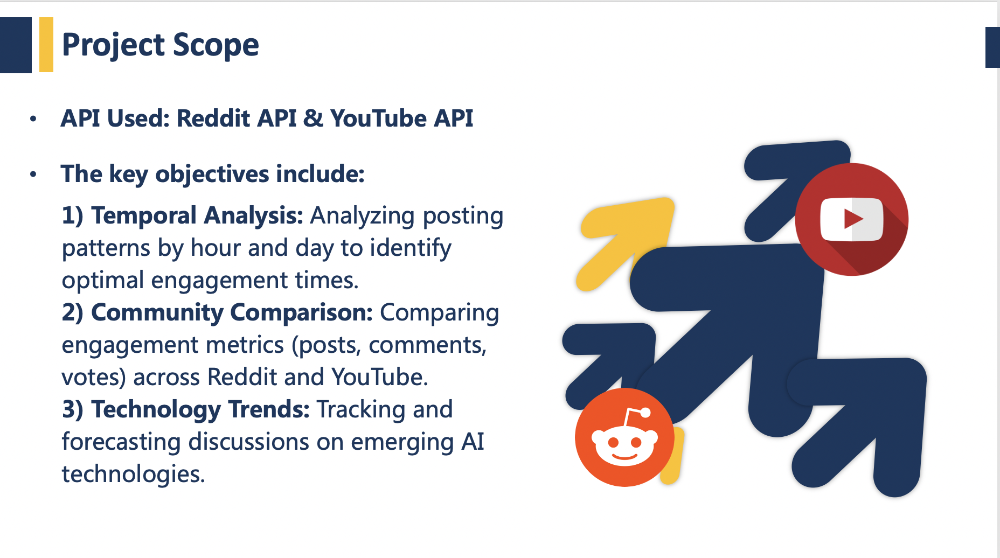
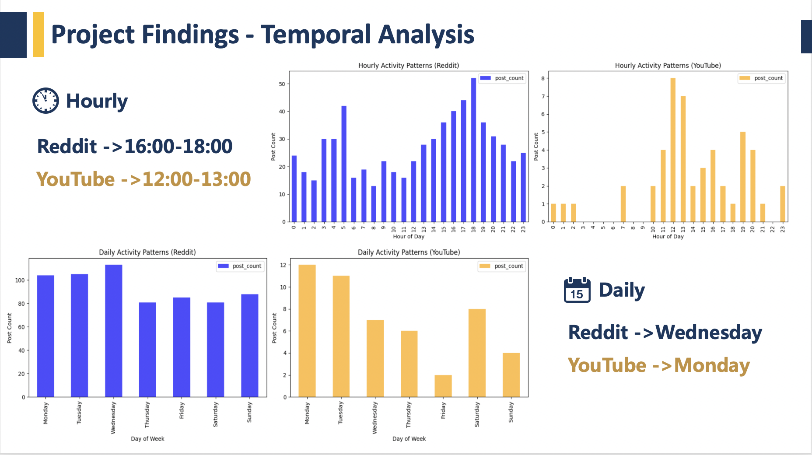

# AI Social Media Analysis: Reddit vs YouTube

This project analyzes how AI-related discussions differ across Reddit and YouTube using exploratory data analysis, NLP, and time-based trend modeling.

## 🔍 Scope
- APIs: Reddit API & YouTube API
- Focus:
  - Temporal Analysis of engagement by hour/day
  - Community Comparison (comments, posts, etc.)
  - Tech Trend Forecasting using keyword tracking

## 📈 Key Findings

### Word Cloud Comparison
- **Reddit** → Deep AI discussions (training, ethics, research)
- **YouTube** → Mainstream awareness (robots, ChatGPT, trends)

### Optimal Posting Time
- **Reddit**: Wed, 4–6PM
- **YouTube**: Mon, 12–1PM

## 📊 Project Files
- [🧠 Notebook](code/AI_SocialMedia_Analysis.ipynb)
- [📽 Slide Deck](slides/AI_Temporal_Trends_Presentation.pptx)

## 🚀 Future Work
- Use BERT/VADER for sentiment
- Apply ARIMA/Prophet/LSTM for forecasting
- Expand dataset size

---

## 📬 Contact
Qing Guo – UC Davis MSBA  
This project was completed for BAX 422 – Data Design & Representation
