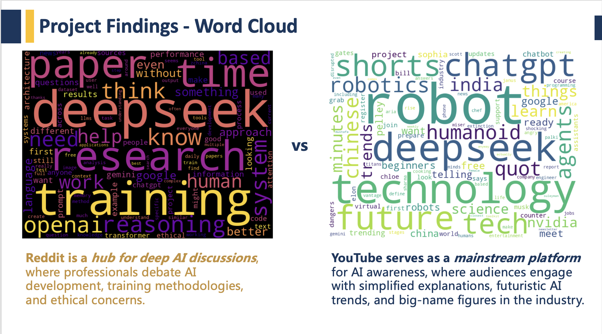

# 🧠 AI Social Media Analysis

This project compares AI-related discussions across Reddit and YouTube using Python-based data collection, exploratory analysis, and trend forecasting. It was built as part of UC Davis MSBA's *BAX 422: Data Design & Representation* course.

---

## 🚀 Project Scope

We used the Reddit API and YouTube API to gather engagement data on AI-related posts and videos. Our goals included:

- 📅 **Temporal Analysis**: Identify optimal times to post AI content  
- 🤝 **Community Comparison**: Measure engagement differences across platforms  
- 📈 **Trend Forecasting**: Predict future mentions of key AI technologies

[Scope](images/scope.png)

---

## 🔍 Key Findings

### 🔹 Temporal Analysis  
Reddit users engage most on **Wednesdays 4–6 PM**, while YouTube engagement peaks on **Mondays 12–1 PM**.

[Temporal Analysis](images/temporal.png)

---

### 🔹 Community Comparison  
YouTube posts generate **more comments per post** despite lower post volume, due to video content’s emotional pull.

[Community Comparison](images/community.png)

---

### 🔹 Word Cloud: Reddit vs YouTube  
- **Reddit** → technical debates, ethics, training methods  
- **YouTube** → simplified explanations, buzzwords, futurism

---

### 🔹 Trend Forecasting  
Reddit shows steady mention growth for terms like **ChatGPT**, **DeepSeek**, and **Gemini**.  
YouTube mentions remain flat.

---

## 💼 Project Files

- 📓 [`AI_SocialMedia_Analysis.ipynb`](code/AI_SocialMedia_Analysis.ipynb) – EDA, modeling, visualizations
- 📊 [`AI_Temporal_Trends_Presentation.pptx`](slides/AI_Temporal_Trends_Presentation.pptx) – Slide deck summarizing insights

---

## 🔧 Limitations

- API rate limits restricted data size
- Linear regression used; more advanced models (e.g. ARIMA, LSTM) could improve forecasts
- Word cloud lacks semantic grouping

---

## 🔮 Future Work

- Use BERT or VADER for sentiment analysis  
- Apply ARIMA, Prophet, or LSTM for trend prediction  
- Expand data collection across more channels and timeframes  

---

---

## ⭐️ Preview

> Live project card available at [rachelqingguo.github.io](https://rachelqingguo.github.io) *(if published via Hugo)*  
> GitHub Repo: [AI-Social-Media-Analysis](https://github.com/rachelqingguo/AI-Social-Media-Analysis)
